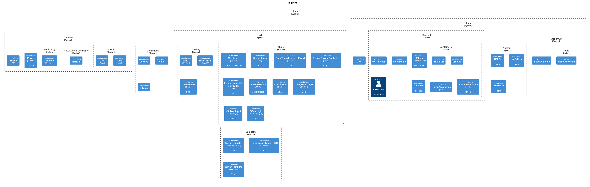

# SmartHome
# TL;DR
A tutorial how to build smart home from scratch. Still PoC. 
## Decisions log

| Decision    | Rationale                                                                                 | Status   |
|-------------|-------------------------------------------------------------------------------------------|----------|
| big-picture | Want to track vision of the system with big picture.                                      | TBD      |
| hosting/deployment | Want to host applications with docker - defined with docker compose. | WIP(PR3) |


# requirements
- SSH development with VS Code
- dev environment on Azure VM
- want to make SSO for all applications

# Hardware
# Software
## docker
- one shared network for all composes
- most of the volumes are as local folders (TBD: need to check what about PROD env)
- single environment file for all composes


### run
to run solution use 
```cmd
docker-compose up
```
with `DEV` override
```cmd
docker-compose -f docker-compose.yml -f docker-compose.dev.override.yml --env-file ./config/.env.dev up
```
with force recreate
```cmd
docker-compose -f queue/docker-compose.yaml --env-file .env.dev up -d --force-recreate
```

#### list of composes
##### home-assistant
use docker-compose `docker-compose.yml` with `DEV` override
```cmd 
docker-compose -f docker-compose.yml -f docker-compose.dev.override.yml --env-file .env.dev up
```
##### queue
```cmd
docker-compose -f queue/docker-compose.yaml --env-file .env.dev up -d --force-recreate
```
##### observability
```cmd
docker-compose -f observability/docker-compose.yaml --env-file .env.dev up -d --force-recreate
```
