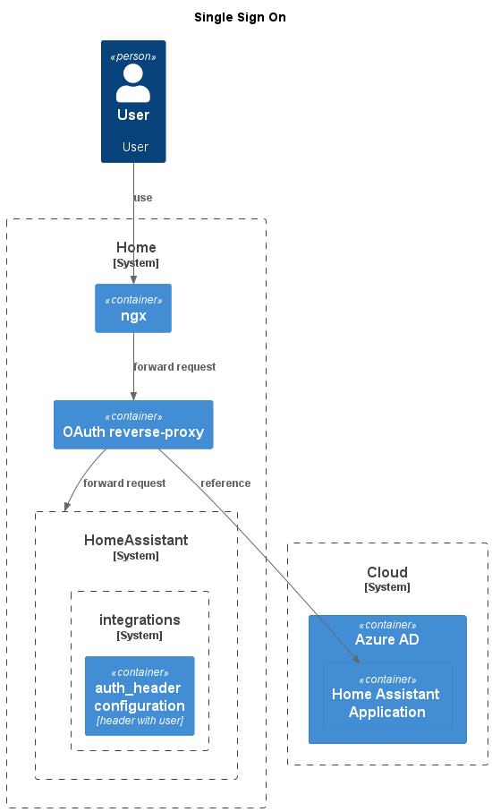

## requirements
- enable SingleSingOn for HomeAssistant
- base plan is to integrate with Azure AD - OpenID Connect protocol

## SOLUTION
- SSL termination is done by nginx
- temporary solution with facebook login
- shared cookie to be able to use SSO with other application (new setup OauthProxy instance) (TBD: need to build and test)

